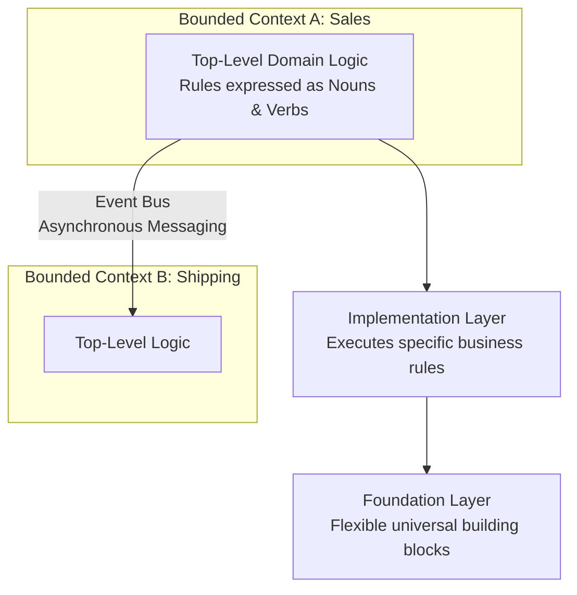

---
categories:
- domain-driven-design
created: '2026-07-02T06:13:31.826646+00:00'
id: bounded-contexts
modified: '2026-07-02T06:13:31.826663+00:00'
tags:
- bounded-contexts
- architecture
- event-bus
title: Bounded Contexts and Multi-Level Architecture
type: leaf
---

A Bounded Context is a strict architectural boundary within which a specific Ubiquitous Language is enforced. It is the technical execution of KADS "Scope Bounding".

* **Multi-Level Architecture**: Inside a bounded context, logic is explicitly layered. The **Top-Level Logic** reads like a domain manual, directly mapping the nouns and verbs of the business. The **Implementation Level** contains the specific algorithms to execute those commands. The **Foundation Level** contains universal, reusable building blocks that can adapt to new domain models without requiring full rewrites.
* **Semantic Isolation**: The noun `Product` might mean "something we sell" in the Sales context, but "a physical box with dimensions and weight" in the Shipping context. Bounded contexts prevent these definitions from colliding and polluting the codebase. 
* **Event Buses**: When contexts need to communicate across boundaries, they do not share databases or internal classes. Instead, they communicate asynchronously via Event Buses (e.g., publishing a `ProductSold` event), allowing different system components to react to state changes dynamically without tightly coupling their internal models.