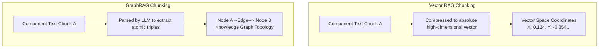

---
categories:
- ai-integration
created: '2026-07-02T05:21:02.534052+00:00'
id: chunking-paradigms
modified: '2026-07-02T05:21:02.534068+00:00'
tags:
- chunking
- graphrag
- vector-rag
title: 'Chunking Paradigms: Vector RAG vs. GraphRAG'
type: leaf
---

The strategy used to chunk componentized documentation dictates how an AI retrieval system searches, traverses, and understands system structures.

### Vector RAG Chunking (Proximity-Based Semantic Extraction)
Traditional Vector RAG operates on the assumption that documents are flat, independent, and identically distributed strings of text.
* **The Mechanism**: Text components are passed through a parser. These text chunks are assigned fixed length windows along with a boundary overlap margin. Each isolated block is mathematically compressed into a single high-dimensional coordinate (a dense vector embedding).
* **Retrieval Limitation**: Retrieval relies entirely on cosine similarity. If a user asks a cross-cutting question, Vector RAG only retrieves the chunks containing the specific text string matching the query. It completely misses dependencies housed in disconnected documentation chunks.

### GraphRAG Chunking (Structural Entity-Relationship Extraction)
GraphRAG treats documentation as a highly connected network topology of concepts, workflows, and dependencies.
* **The Mechanism**: The structural text chunk is used merely as a launching pad. Once a markdown document is split, an initial LLM indexing pass scans the chunk to extract atomic semantic components: Entities and Typed Relationships. These are stored explicitly as nodes and edges in a Graph database.
* **Retrieval Capability**: When a query hits the system, the architecture maps the query to the corresponding entity nodes and executes a multi-hop graph traversal algorithm, pulling the entire downstream contextual tree regardless of where those dependencies were physically authored.