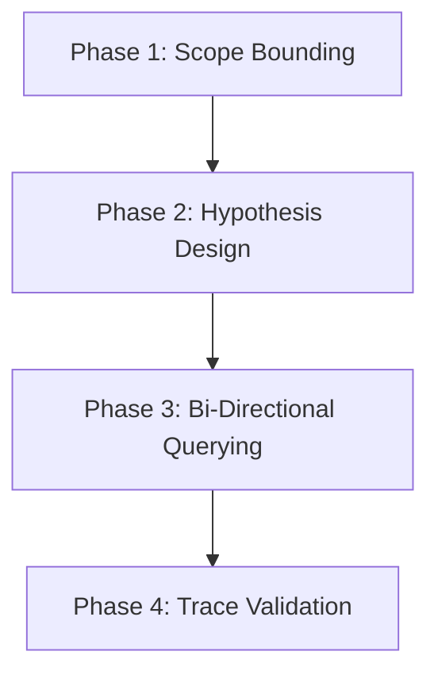

---
categories:
- elicitation
created: '2026-07-02T05:26:21.049244+00:00'
id: interview-protocol
modified: '2026-07-02T05:26:21.049260+00:00'
tags:
- protocol
- lifecycle
- sme
title: The SME Interview Protocol Lifecycle
type: leaf
---

To optimize engagement with highly constrained experts, KADS organizes the elicitation process into a rigorous, four-phase lifecycle. Each phase is dependent on the completion of the previous one.

* **Phase 1: Scope Bounding**: This initial phase defines strict guardrails for the elicitation session. The engineer bounds the inquiry to a single, isolated domain boundary or component. Any attempts by the expert to drift into peripheral topics are documented as out-of-scope and parked for future modules. Bounding prevents cognitive overload for both parties and ensures high information density.
* **Phase 2: Hypothesis Design**: Armed with the data gathered during artifact archeology, the engineer constructs a preliminary, rough model of the expert's workflow, system state machine, or decision logic. This model is not expected to be perfectly accurate; its sole purpose is to serve as an initial structure. By walking into the session with a hypothesis, the engineer shifts the expert's role from generating content from scratch to correcting and refining an existing structure, which is a much easier cognitive task.
* **Phase 3: Bi-Directional Querying**: The execution of the interview relies on a deliberate oscillation between two questioning modes:
    * **Discovery Prompts (Open-Ended)**: Used to uncover unknown variables and hidden dependencies.
    * **Validation Prompts (Closed-Ended)**: Used immediately after to lock down precise rules, boundaries, and constraints.
* **Phase 4: Formal Trace Validation**: Immediately following the interview, the engineer transcribes the session into a deterministic logic flow, such as a formal pseudo-code block or a strict decision tree. The expert is then required to review, correct, and formally sign off on this trace artifact. This guarantees that all extreme edge cases, error-recovery pathways, and implicit structural constraints are permanently captured and verified before documentation begins.