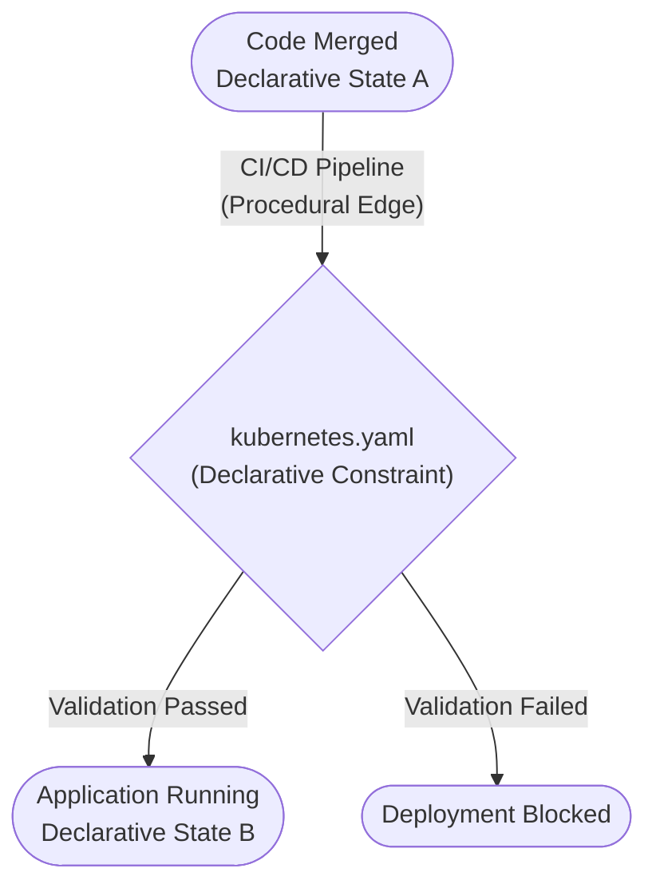
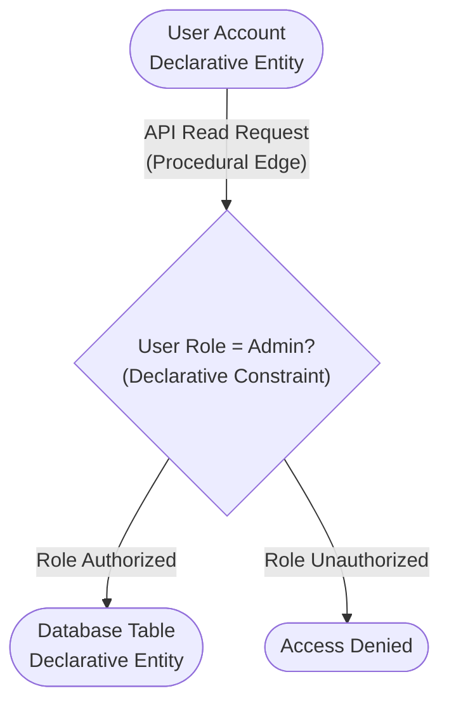
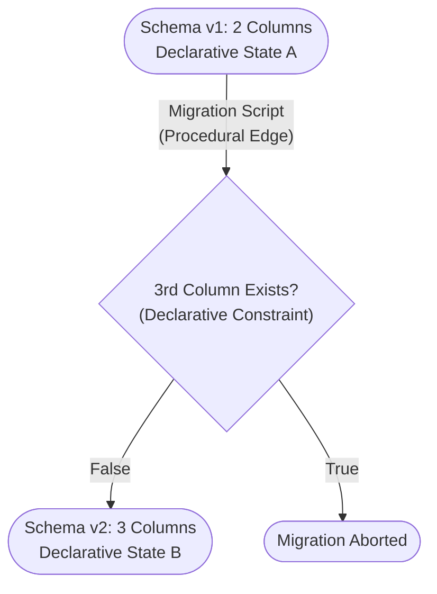

---
categories:
- structuring
created: '2026-07-02T05:20:40.839087+00:00'
id: knowledge-networks
modified: '2026-07-02T05:56:24.765777+00:00'
tags:
- networks
- graphs
- state-machines
title: Formalizing Knowledge Networks
type: leaf
---

To visualize how declarative facts interact with procedural operations, systems can be modeled as state machines or relational graphs. This formalization maps how declarative constraints directly dictate the path of procedural workflows.

* **Entity-Relation Mapping**: Declarative objects act as vertices, while procedural dependencies serve as directed edges.
* **Constraint Resolution**: Every step in a procedure must validate its inputs against the structural limits defined by the declarative model.
* **State Transitions**: Procedures mutate the system from one valid declarative state to another, ensuring data integrity is maintained at every junction.

### Practical Application Examples

To make these abstract principles concrete, here is how they map directly to common software engineering domains:

#### Example 1: CI/CD Pipeline Execution

* **Entity-Relation Mapping**: The declarative configuration files (e.g., `kubernetes.yaml` limits, `package.json` dependency versions) are the static **vertices** (Entities). The automated CI/CD build scripts are the **directed edges** (Procedural Relations).
* **Constraint Resolution**: Before a build script (procedure) can successfully deploy an app to a production cluster, it must validate its payload against the `kubernetes.yaml` (declarative constraint) to ensure the target cluster allows the requested memory allocation.
* **State Transitions**: The system moves from a state of "Code Merged" (Declarative State A) to "Application Running" (Declarative State B) solely through the successful execution of the deployment pipeline (Procedure).

#### Example 2: Identity and Access Management (IAM)

* **Entity-Relation Mapping**: A User Account, an assigned Role (e.g., `Admin`), and a target Database Table are declarative **vertices**. The API request attempting to fetch data from the table is the procedural **edge**.
* **Constraint Resolution**: When the API request (procedure) fires, it hits a policy engine that reads the User's Role (declarative constraint). If the Role lacks explicit `Read` access to the Table, the procedural request is instantly blocked.
* **State Transitions**: An admin running a script to assign a new Role to a User changes the user's baseline permissions, mutating the overall system from "User = Unauthorized" to "User = Authorized."

#### Example 3: Database Schema Migrations

* **Entity-Relation Mapping**: The existing SQL schema (e.g., Table `Users` has 2 columns) is a declarative **vertex**. The migration script tasked with adding a 3rd column is the procedural **edge**.
* **Constraint Resolution**: The migration script (procedure) must first verify if the 3rd column already exists in the current schema (declarative constraint). If it does, the script aborts to prevent a structural integrity error.
* **State Transitions**: Executing the script mutates the database from "Schema v1" to "Schema v2", establishing a completely new declarative baseline for all future procedures.