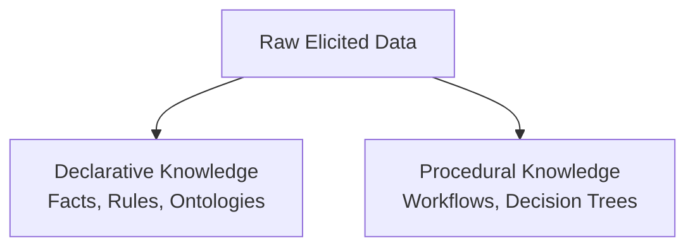

---
categories:
- structuring
created: '2026-07-02T05:20:36.751642+00:00'
id: knowledge-typologies
modified: '2026-07-02T05:20:36.751659+00:00'
tags:
- typologies
- declarative
- procedural
- structural
title: The Core Knowledge Typologies
type: leaf
---

KADS divides domain knowledge into three foundational, mutually exclusive dimensions. Understanding these distinctions is critical for choosing the right documentation strategy.

* **Declarative Knowledge (The "What")**: This represents the static layer of a domain. It includes explicit facts, structural schemas, system topologies, domain invariants, configuration states, and compliance rules. It is descriptive, factual, and non-sequential.
* **Procedural Knowledge (The "How")**: This represents the dynamic, execution layer of a domain. It maps chronological actions, state transitions, operational workflows, and conditional branching paths. Procedural knowledge details how to manipulate the declarative layer to achieve a specific goal. It is prescriptive, action-oriented, and ordered.
* **Structural Knowledge (The "Why")**: This represents the contextual, meta-layer of the domain. It defines the overarching taxonomies, design patterns, architectural rationales, and systemic boundaries that tie declarative entities to procedural workflows. Structural knowledge explains why a particular declarative pattern or procedural path was chosen over alternatives. It provides the connective tissue that turns isolated facts and procedures into a unified engineering model.